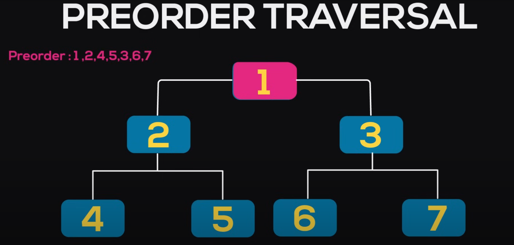
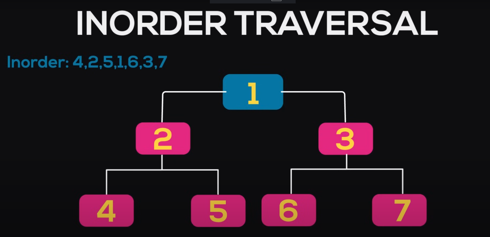
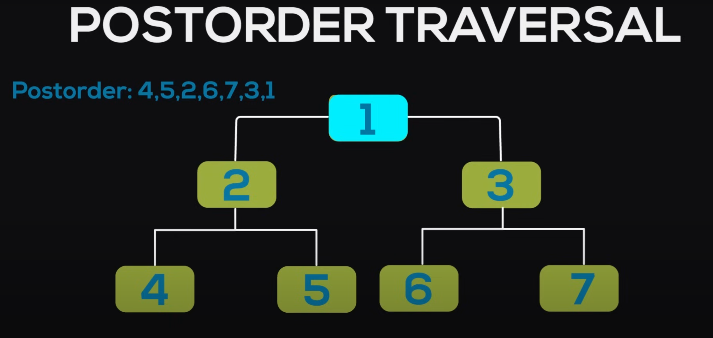
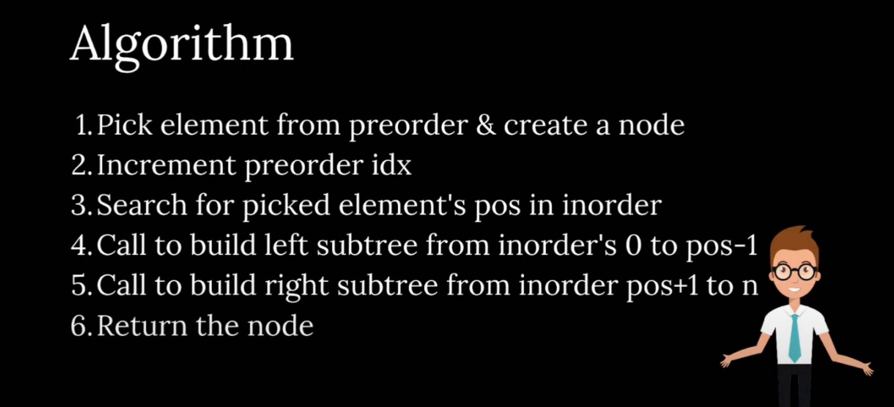
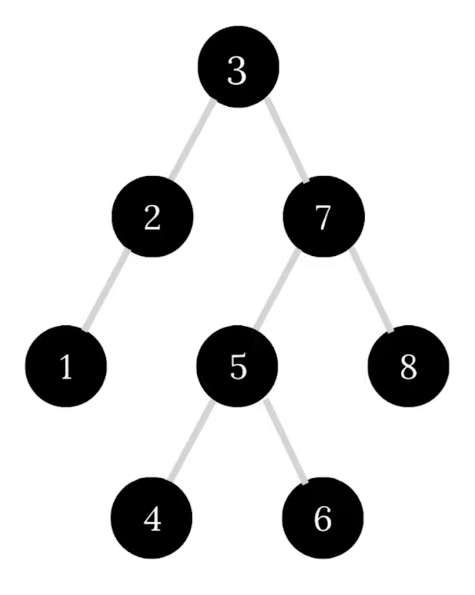

# Tree Notes

### 1. Trees contain three level:

### <ol><li>Root <li>Branches <li>Leaves

### 2. Normal Trees can contain as many child notes to a parent node.

### 3. Binary tree is the type of tree in which each node has only two child nodes.

### 4. Properties of Binary tree:

### <ol><li> Maximum nodes at level L = 2<sup>L</sup>.</li>   <li> Maximum nodes in a tree of height H = 2<sup>H</sup>-1.</li>    <li>For N nodes, minimum possible height or minimum number of levels are log<sub>2</sub>(N+1).</li>  <li>A binary tree with L leaves has at least log<sub>2</sub>(N+1)+1 number of leaves.</li>

### 5. Traversal Methods In Trees:

### <li> PreOrder Transversal:

### In PreOrder Transveral, first we start from root note down its value an then we traverse to the left subtree and continue it until the left subtree is covered then we travel to the right subtree. <br><br>



```c++
//Function for performing preorder traversal
void preorder(struct Node* root){
    if(root == NULL){
        return;
    }
    cout << root->data << " ";
    preorder(root->left);
    preorder(root->right);
}
```

### <li> InOrder Traversal:

### In InOrder Traversal, first we travel to the left subtree until we reach the end of the subtree then we note down the value and then we move to the right subtree. <br><br>



```c++
//Function for performing inorder traversal
void inorder(struct Node* root){
    if(root == NULL){
        return;
    }
    inorder(root->left);
    cout << root->data << " ";
    inorder(root->right);
}
```

### <li> PostOrder Traversal:

### In PostOrder Traversal we first travel to the left subtree and the right subtree and then note the value. <br><br>



```c++
//Function for performing postorder traversal
void postorder(struct Node* root){
    if(root == NULL){
        return;
    }
    postorder(root->left);
    postorder(root->right);
    cout << root->data << " ";
}
```

### 6. Creating tree using preorder and inorder:

### <li> Algorithm: <br><br>



### For Step 1, Step 2, Step 4, Step 5:

```c++
    Node* buildTree(int preorder[], int inorder[], int start, int end){
    static int idx = 0;

    if(start > end){
        return NULL;
    }

    int curr = preorder[idx];
    idx++;
    Node* node = new Node(curr);

    if(start == end){
        return node;
    }

    int pos = search(inorder, start, end, curr); //Calling search function

    node->left = buildTree(preorder, inorder, start, pos - 1);
    node->right = buildTree(preorder, inorder, pos + 1, end);

    return node;
};
```

### For Step 3:

```c++
int search(int inorder[], int start, int end, int curr){
    for (int i = start; i <= end; i++){
        if(inorder[i] == curr){
            return i;
        }
    }
    return -1;
}
```
### 7. Creating tree using postorder and inorder:
---
### **Binary Search Tree**

### 1. Binary Search tree follows 3 rules:

### <u>RULE 1:</u> The left subtree of a node contains only nodes with keys lesser than the node's key.

### <u>RULE 2:</u> The right subtree of a node contains only nodes with keys greater than the node's key.

### <u>RULE 3:</u> The left and right subtree each must also be a binary search tree. There must be no duplicate nodes.

### This is a binary search tree: <br><br>

